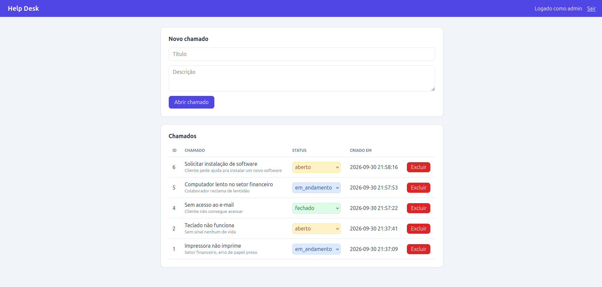

# Help Desk PHP

Sistema simples de chamados de suporte (CRUD) feito com PHP, MySQL e Docker.

## Funcionalidades

- Abrir chamados (título e descrição)
- Listar chamados
- Alterar o status: aberto, em andamento, fechado
- Excluir chamados

## Tecnologias

- PHP 8.3 (Apache) com PDO
- MySQL 8.4
- Docker e Docker Compose

## Boas práticas aplicadas

- Consultas com prepared statements (proteção contra SQL injection)
- Saída escapada com `htmlspecialchars` (proteção contra XSS)
- Credenciais fora do código, em arquivo `.env` (não versionado)
- Tabela criada automaticamente por `db/init.sql`

## Como rodar

1. Clone o repositório e entre na pasta:

       git clone https://github.com/angelommorozini/helpdesk-php.git
       cd helpdesk-php

2. Crie o arquivo `.env` a partir do exemplo e troque as senhas:

       cp .env.example .env

3. Suba os containers:

       docker compose up -d --build

4. Abra no navegador: `http://localhost:8080`

## Estrutura

    .
    ├── Dockerfile
    ├── docker-compose.yml
    ├── .env.example
    ├── db/init.sql
    └── src/
        ├── db.php
        └── index.php
